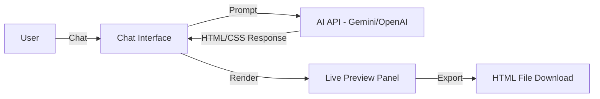

# Planding MVP — Platform tạo Landing Page bằng AI Chat

## Tổng quan

Xây dựng MVP cho platform **Planding** — nơi doanh nghiệp có thể tạo landing page quảng bá bằng cách **chat với AI agent**. AI sẽ hỏi từng bước về ngành nghề, phong cách, nội dung, màu sắc... rồi tự động sinh ra landing page hoàn chỉnh, hiển thị preview real-time.

### Phạm vi MVP
- **Frontend only** — React (Vite), dùng Gemini API (đã có API key)
- **Flow chat có hướng dẫn** — AI dẫn dắt từng bước, thu thập thông tin rồi sinh page
- **Giao diện hoàn toàn tiếng Việt** — Cả UI lẫn AI agent đều giao tiếp bằng tiếng Việt
- **Trang Home giới thiệu** — Landing page giới thiệu platform trước khi vào giao diện chat
- Chưa có backend riêng, auth, database, hay hệ thống deploy

---

## Kiến trúc hệ thống MVP



### Luồng hoạt động chính

1. **Onboarding**: User vào app → Chọn "Tạo Landing Page mới"
2. **Guided Chat**: AI hỏi lần lượt:
   - Bước 1: Ngành nghề / Loại hình doanh nghiệp
   - Bước 2: Tên thương hiệu, slogan
   - Bước 3: Mục đích landing page (quảng bá, thu lead, giới thiệu sản phẩm...)
   - Bước 4: Phong cách thiết kế (hiện đại, tối giản, sang trọng, trẻ trung...)
   - Bước 5: Màu sắc chủ đạo (hoặc để AI đề xuất)
   - Bước 6: Nội dung chính (sản phẩm, dịch vụ, thông tin liên hệ...)
3. **Generate**: AI sinh HTML/CSS landing page hoàn chỉnh
4. **Preview**: Hiển thị preview real-time bên cạnh chat
5. **Iterate**: User có thể yêu cầu chỉnh sửa qua chat ("đổi màu header", "thêm section testimonial"...)
6. **Export**: Download file HTML hoàn chỉnh

---

## Tech Stack

| Thành phần | Công nghệ | Lý do |
|---|---|---|
| **Framework** | React + Vite | Nhẹ, nhanh, hot reload tốt cho MVP |
| **Styling** | Vanilla CSS + CSS Variables | Linh hoạt, không dependency thêm |
| **State Management** | React Context + useReducer | Đủ cho MVP, không cần Redux |
| **AI API** | Google Gemini API (gemini-2.0-flash) | Free tier rộng rãi, hỗ trợ structured output |
| **Code Rendering** | iframe sandbox | An toàn, isolated, hiển thị HTML/CSS chính xác |
| **Icons** | Lucide React | Nhẹ, đẹp, tree-shakable |
| **Fonts** | Google Fonts (Inter, Outfit) | Typography hiện đại |

---

## Cấu trúc thư mục

```
planding-project/
├── index.html
├── package.json
├── vite.config.js
├── .env.example
├── .gitignore
├── src/
│   ├── main.jsx
│   ├── App.jsx
│   ├── index.css
│   ├── components/
│   │   ├── Chat/
│   │   │   ├── ChatPanel.jsx
│   │   │   ├── ChatMessage.jsx
│   │   │   ├── ChatInput.jsx
│   │   │   └── StepIndicator.jsx
│   │   ├── Preview/
│   │   │   ├── PreviewPanel.jsx
│   │   │   ├── DeviceFrame.jsx
│   │   │   └── PreviewToolbar.jsx
│   │   └── Landing/
│   │       ├── HeroSection.jsx
│   │       └── FeatureSection.jsx
│   ├── context/
│   │   └── ChatContext.jsx
│   ├── services/
│   │   ├── aiService.js
│   │   ├── promptBuilder.js
│   │   └── guidedFlow.js
│   └── utils/
│       └── exportUtils.js
├── docs/
│   ├── implementation_plan.md    ← file này
│   ├── components.md             ← chi tiết từng component
│   └── changelog.md              ← lịch sử thay đổi
├── tasks/
└── .agents/
    └── AGENTS.md
```

---

## Lưu ý bảo mật

> ⚠️ **API Key**: API key Gemini được lưu trong `.env` file (client-side). Trong production cần proxy qua backend để bảo mật.

---

## Quyết định đã xác nhận

- ✅ **Gemini API Key**: Đã có sẵn
- ✅ **Ngôn ngữ giao diện**: Hoàn toàn tiếng Việt (UI + AI agent)
- ✅ **Trang Home**: Có — trang giới thiệu platform trước khi vào chat
